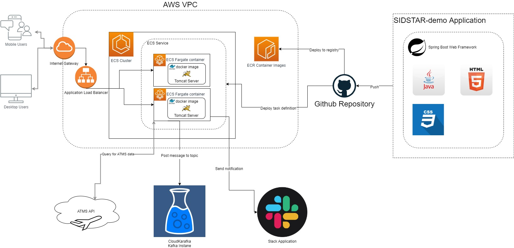

# sidstar-demo
This is a web application that is used to retrieve a list of airports from ATMS and also find waypoints that has the highest and second highest number of association with the SIDs/STARs of a particular aiport.

The backend is built with JAVA with MAVEN, containerised in Docker and then hosted on AWS Elastic Container Service.

The front end is built with HTML, CSS and JS. Although it is segregated from backend code, it is deployed in the same container for ease of development.

## Architecture



## Software and Account Requirements

1) IntelliJ IDEA 2022.1.2 (Community Edition)
2) AWS Account
3) GitHub account
4) ATMS API (https://open-atms.airlab.aero/public-api/)

## Install and Setup Guide

Steps:
1) Download and install Intellij Community Edition
2) Clone project from this repository
3) Set up Github account
4) Push project to your Github repository
5) Set up AWS and the necessary Services
6) Set up Github actions
7) Deploy!!

### Download and install Intellij Community Edition
You can download and install Intellij Community Edition from here

https://www.jetbrains.com/idea/download/#section=windows

### Clone project from this repository
All the resources and dependencies are included in this project, so all you have to do is ask Intellij to clone this project.

Instructions can be found here:
https://blog.jetbrains.com/idea/2020/10/clone-a-project-from-github/

### Set up Github Account
Set up a github account and repository to host this project and enable the CI/CD pipeline.

1) Sign up for github account at https://github.com/join
2) After you log in, on the left plane, click "New"
3) Key in your desired repository name, description, private or public setting and click "Create Repository".

### Push project to your Github repository
1) In intellij, under the VCS tab, click "Git" and then "Manage Remotes"
2) Change remote address to your GitHub repo address
3) Push to your repo

### Set up AWS and the necessary Services
For this project, the Github Action function to deploy this app to AWS is stored in:

```code
.github/maven-docker.aws.yml
```

Fill in the following environment variables in the file stated above:
* AWS_REGION
* ECR_REPOSITORY
* ECS_SERVICE
* ECS_CLUSTER
* CONTAINER_NAME

Also set your AWS Secrets for the user that you wish to use for deployment.

Lastly set your task execution ARN in ```.aws/task_definition.json``` in the "executionRoleArn" variable.


You can find more details in these guides below:

Deployment from GitHub to ECS

https://docs.github.com/en/actions/deployment/deploying-to-your-cloud-provider/deploying-to-amazon-elastic-container-service

Task Execution IAM for ECS

https://docs.aws.amazon.com/AmazonECS/latest/developerguide/task_execution_IAM_role.html

### Deploy!
Deploy and have fun!

## Solution Design

### Frameworks, Libraries and API
| Item              | Type          | Description                                                                                                                           |
|:------------------|:--------------|:--------------------------------------------------------------------------------------------------------------------------------------|
| Spring Boot MAVEN | Framework     | create stand-alone, production-grade Spring based Applications that you can "just run".                                               |
| JSON.simple       | JAVA Library  | From https://mvnrepository.com/artifact/com.googlecode.json-simple/json-simple. Allows easy handling of JSON in JAVA.                 |
| Datatables.js     | JS Library    | From https://datatables.net/. Add advanced interaction controls to my HTML tables.                                                    |
| Bootstrap         | CSS Framework | CSS Framework for developing responsive and mobile-first websites.                                                                    |
| JQUERY            | JS Library    | JavaScript library designed to simplify HTML DOM tree traversal and manipulation, as well as event handling, CSS animation, and Ajax. |
| ATMS API          | RESTful API   | Provides simple and easy to use APIs to retrieve airport and standard instrument data                                                 |


### Building the backend
The backend is built using JAVA with Spring Boot framework. It exposes two RESTFUL APIs:

```http
POST /api/getAirports
```

| Parameter | Type | Description |
| :--- | :--- | :--- |
| `apiKey` | `string` | **Required**. The API key to ATMS |

```http
POST /api/getTopTwoAssoWaypoints
```

| Parameter | Type | Description |
| :--- | :--- | :--- |
| `apiKey` | `string` | **Required**. The API key to ATMS |
| `icao` | `string` | **Required**. The airport's icao for this query|
| `stdIntrutmentType` | `string` | **Required**. The choice of Standard Instrument for this query. Values accepted ["sids,"stars"] |

### Backend Functions in detail

#### /api/getaiport
This retrieves the list of airports from ATMS API and return the data in the following format:

```javascript
{
  "data" : [
    { 
      "uid":string,
      "iata":string,
      "name":string,
      "lat":double,
      "lng":double,
      "alt":double
    },
  ]
}
```

#### /api/getTopTwoAssoWaypoints
This RESTFUL api does the following:
* Retrieves the list of SID/STARs pertaining to a particular airport 
* Iterates through each SID/STAR and their waypoints to count the total associations of each waypoint using its name as a unique identifier
* Find the top two number of counts
* Return all waypoints that has the same value as either the top or second number of counts with the following format

```javascript
{
 "topWaypoints" : [
   [
    {
     "name":string,
     "count":string,
    },
 ]
}
```

### Front end
The front end is coded in HTML, CSS and JAVA. It uses JQUERY to do ajax requests to the backend APIs to retrieve the data for display.

### Set up CI/CD Pipeline
This project uses GitHub actions to create the CI/CD pipeline. The CI starts from a push to this project's repository and ends at deployment of docker image to AWS ECS.

The Github actions run in latest ubuntu environment.

3 Workflows are used in this project:

1) Build application
   1) Uses open-JDK 18
   2) Runs MAVEN clean and install to produce JAR package
2) Dockerise 
   1) Add Jar file to docker container and publish to GitHub Package repository for local testing
3) Deploy to AWS ECS
   1) Create a docker image and push to AWS Elastic Container repository
   2) Fill in the new image ID in the Amazon ECS task definition
   3) Deploy Amazon ECS task definition


